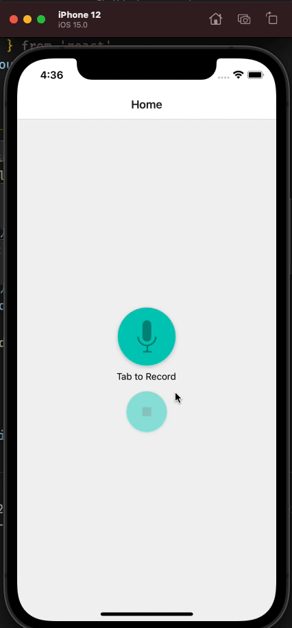

<!-- PROJECT LOGO -->
 

  <h3 align="center">Crazy Voice</h3>

  

    Mobile app that enables you to record and playback your voice with funny effects
     
     
  

<!-- ABOUT THE PROJECT -->

## About The Project

Crazy Voice is a mobile app that can record voice and play it again with funny voice effects

### Built With

The application is built using the following technologies

-   [React Native](https://reactnative.dev/)
-   [Expo](https://docs.expo.dev/)
-   [Expo AV-Audio](https://docs.expo.dev/versions/latest/sdk/audio/#audiosetaudiomodeasyncmode)
-   [React Navigation](https://reactnavigation.org/)

<!-- GETTING STARTED -->
<!--
## Getting Started

 -->

### Prerequisites

You should have node.JS along with Expo-CLI installed on your machine.
For running the app, you can either run it on a simulator/emulator or download Expo Go app and run it on your mobile.

To install the required dependencies:

-   Download and Install [NodeJS](https://nodejs.org/dist/v14.18.0/node-v14.18.0.pkg)
-   Install Expo CLI: ` npm install -g expo`

### Installation

1.  cd to the project directory: `cd crazy_voice`
2.  install required dependencies: `expo install`
3.  run expo metro server: `expo start`

<!-- USAGE EXAMPLES -->

<!-- ## Usage

Use this space to show useful examples of how a project can be used. Additional screenshots, code examples and demos work well in this space. You may also link to more resources. -->

<!-- CONTACT -->

## Contact

Abdulrahman Elsharqawi - [@sharqawidev](https://twitter.com/sharqawidev) - sharqawi.dev@gmail.com

Project Link: [https://github.com/sharqawidev/crazy_voice](https://github.com/sharqawidev/crazy_voice)
